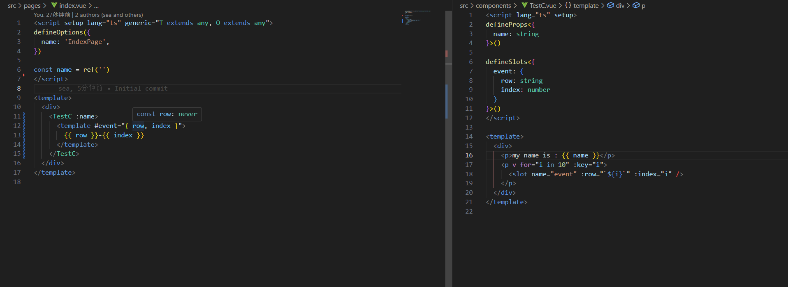

https://github.com/vuejs/language-tools/issues/3955



```bash
git clone https://github.com/warmthsea/test-volar2--defineSlots.git && cd test-volar2--defineSlots
```
```bash
pnpm i && npm run dev
```
#### Example File:
 - [`/src/pages/index.vue`](https://github.com/warmthsea/test-volar2--defineSlots/blob/main/src/pages/index.vue#L12)
 - [`/src/components/TestC.vue`](https://github.com/warmthsea/test-volar2--defineSlots/blob/16afadf92d5279f2a7b11b78c85ed35f11d00122/src/components/TestC.vue#L9)
